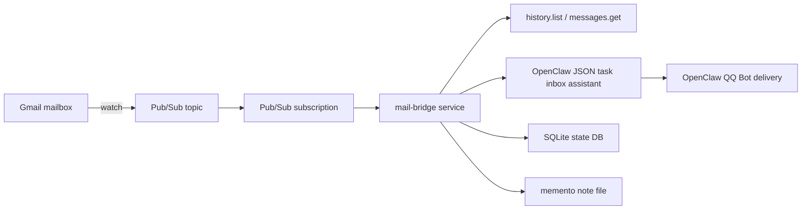

# Architecture

## One-sentence summary

`mail-bridge` listens to Gmail mailbox events in real time, classifies each new message for importance, and only notifies when the message matters.

## Why this project exists

The project is designed to avoid three common failure modes:

- periodic inbox polling
- building multiple direct integrations too early
- sending noisy notifications for low-value mail

It centralizes everything around one Gmail event source.

## Current architecture

## Core modules

### `mail_bridge/main.py`

Builds the FastAPI app, starts the periodic watch renew loop, and starts the local Pub/Sub subscriber.

### `mail_bridge/gmail.py`

Handles Gmail OAuth, `watch`, `history.list`, and `messages.get`.

### `mail_bridge/pubsub_subscriber.py`

Runs local `StreamingPull` against Google Pub/Sub. This is the reason the project can work without a public URL.

### `mail_bridge/service.py`

Main business orchestrator:

- receives Pub/Sub history events
- loads Gmail history
- deduplicates
- classifies
- sends notifications
- records structured logs

### `mail_bridge/classifier.py`

Contains the OpenClaw JSON-only inbox assistant.

The current and only smart path is the OpenClaw JSON-only inbox assistant.

### `mail_bridge/notifier.py`

Current default notifier:

- `openclaw_qqbot`

It sends the final alert through the loaded OpenClaw QQ Bot channel plugin.

It no longer asks an agent to rewrite the outgoing QQ message.

### `mail_bridge/store.py`

SQLite-backed local state store.

Tracks:

- watch state
- Pub/Sub event ledger
- processed messages

## Data flow

### 1. Gmail event

Gmail emits a mailbox change event into the configured Pub/Sub topic.

### 2. Pub/Sub subscription

The local bridge consumes the event through `StreamingPull`.

### 3. History expansion

The bridge uses Gmail `history.list` to expand the event into concrete message additions.

### 4. Message fetch

For each new message, the bridge fetches the full metadata needed for classification:

- sender
- subject
- snippet
- body preview
- attachment names
- labels

### 5. Deduplication

The bridge deduplicates by:

- Gmail message ID
- Internet `Message-ID`
- fallback composite key

### 6. Classification

The OpenClaw inbox assistant returns:

- `important`
- `score`
- `category`
- `reason`
- `qq_text`
- `summary`
- `body_excerpt`
- `send_mode`

### 7. Notification

Only messages classified as important go to the notifier.

The notifier does not send QQ mail.

It uses the local OpenClaw runtime and the QQ Bot plugin to deliver a real QQ message.

### 8. Persistence and observability

The bridge writes:

- structured logs
- SQLite state

## Current runtime mode

This project currently runs in:

- `PUBSUB_MODE=streaming_pull`

That means:

- no public domain needed
- no push callback endpoint required for normal operation
- machine must stay online for real-time delivery

## Important files

- service entry: `mail_bridge/main.py`
- state DB: `data/mail-bridge.db`
- rules file: `../memento/data/mail-bridge-importance.json`
- local env: `.env`
- service logs:
  - `data/mail-bridge-service.log`
  - `data/mail-bridge-service.err.log`

## Current notification path

The notification path is intentionally simple:

- classify and summarize with OpenClaw JSON task
- send a fixed QQ instant message through OpenClaw QQ Bot direct send

The assistant session is now pinned to one inbox session ID and one persistent session transcript file.  
This allows OpenClaw to accumulate mail-specific context over time without mixing it into unrelated chats.

There is also a simple explicit feedback path:

- local API writes user preference notes into the memento rules file
- classifier loads these notes and includes them in every OpenClaw JSON task input

This matches the current local deployment.
